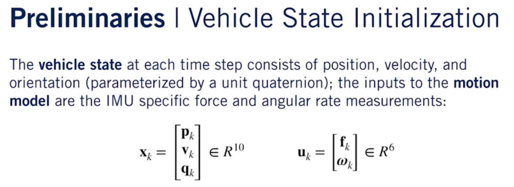
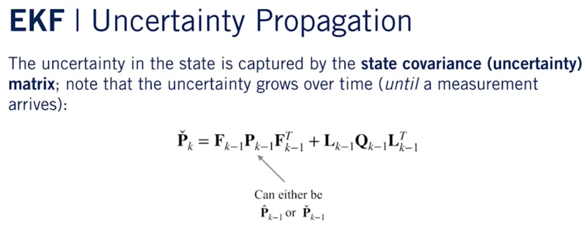

# Error State Extended Kalman Filter
This project provides a Python implementation of the 
Error State Extended Kalman Filter (ES-EKF). It is an 
assignment project of the State Estimation and Localization course
of Self-Driving Cars Specialization by University of Toronto.

# Formulation of ES-EKF
The error-state filter formulation involves three set of states:
- True state: the true state of a system to be estimated. It is
a composition of the nominal state and error state.
- Nominal state: computed by integrating IMU measurements 
(in a non-linear fashion). It is usually very close to the ture state
but contains some error due to noises and biases in IMU measurements.
- Error state: the error between true state and nominal state. It is small
and can be computed through linear-Gaussian filtering.

ES-EKF consists of two alternating steps: prediction and correction. 
In the prediction step, the IMU measurements are integrated to predict 
the nominal state and the state covariance. When a measurement 
from GNSS or LIDAR arrives, the predicted states and covariance are corrected.

The IMU measurements are usually obtained at 100Hz-400Hz, while 
the GNSS or LIDAR measurements arrive at a much lower rate (1Hz). This means 
the correction is only applied after multiple prediction steps.

## Prediction
The state consists of position, velocity, and orientation. It should be noted that the 
orientation is parameterized in different ways in the nominal state and error state. 

The orientation in the nominal state is represented by a unit quaternion. It involves 
redundant parameters but avoids singularities, gimbal lock issues, or the like. 

The orientation in the error state employs a minimal representation: a 3x1 angular vector.
These angular error-state is very close to zero, thus guaranteeing valid linearization
of the error dynamics.

## Correction
The correction consists of two steps:
- Computer of the error-state through filter correction
- Inject the observed error into the nominal state and 
update the covariance matrix
- 

# Running
- Execute the follow command in a terminal: `python3 test_esekf.py`
- Two plots will be displayed if the code runs smoothly. 
The first plot shows the estimated trajectory against the ground
truth. The second plot shows the positional and rotational errors.

# Reference
- [Quaternion kinematics for the error-state Kalman filter](https://arxiv.org/abs/1711.02508)

